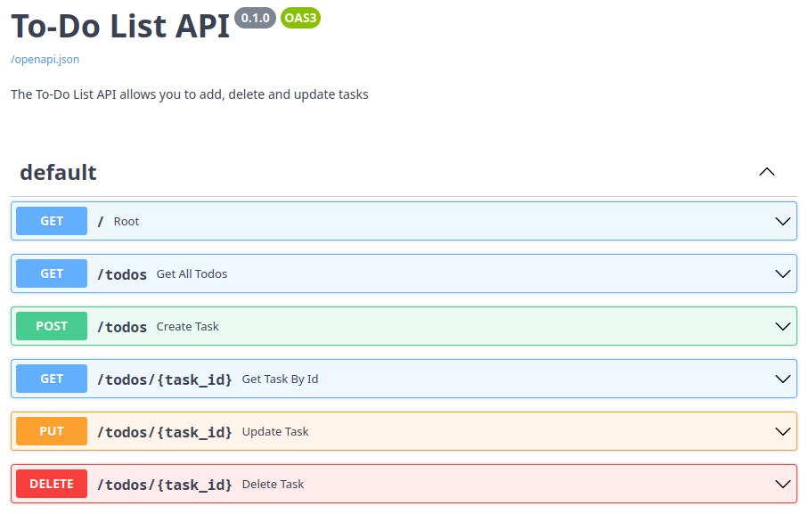

# FastAPI Simple To-Do List Mock

A simple mock To-Do List API using FastAPI and Mongita.



## Table of Contents

- [About](#about)
  - [Built With](#built-with)
- [Getting Started](#getting-started)
  - [Installation](#installation)
- [Usage](#usage)
- [Acknowledgements](#acknowledgements)
- [Licence](#licence)

## About

A simple mock To-Do List API using FastAPI and Mongita, with basic CRUD operations allowing you to create, update and delete tasks.

### Built With

- [Python](https://www.python.org/)
- [FastAPI](https://fastapi.tiangolo.com/)
- [Mongita](https://github.com/scottrogowski/mongita)

## Getting Started

### Installation

1. Clone the repo
   ```sh
   git clone https://github.com/TomJGooding/fastapi-simple-todo-mock.git
   ```
2. Install the requirements. It is recommended to first [create a virtual environment](https://packaging.python.org/en/latest/tutorials/installing-packages/#creating-virtual-environments).
   ```sh
   python3 -m pip install -r requirements.txt
   ```

## Usage

Run the server with:

```sh
uvicorn main:app
```

## Acknowledgements

- The [Python REST APIs With FastAPI](https://realpython.com/courses/python-rest-apis-with-fastapi/) video course by Real Python for getting started with FastAPI

## Licence

Licensed under the [GNU General Public License v3.0](LICENSE).

